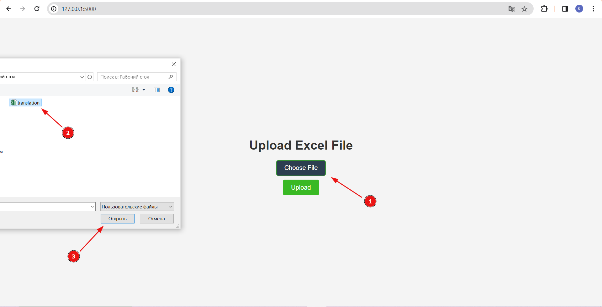
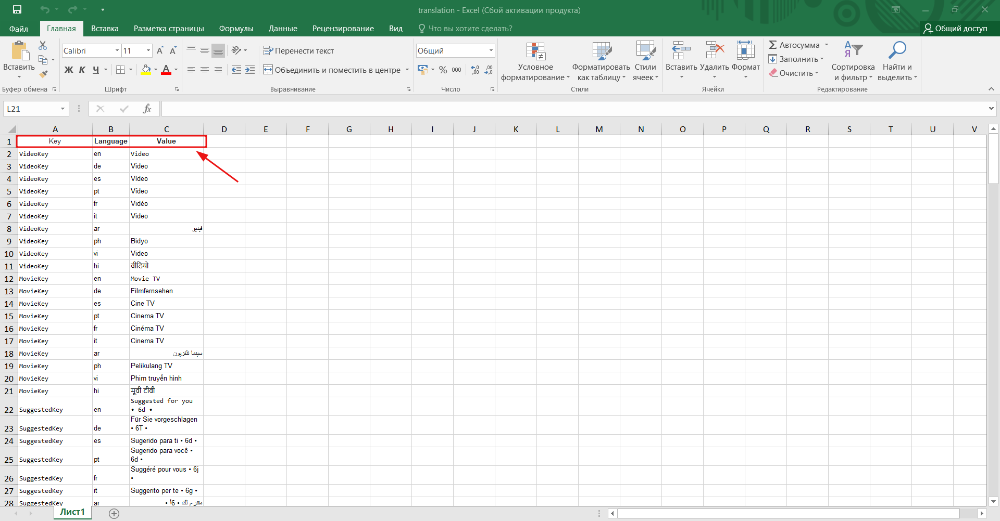
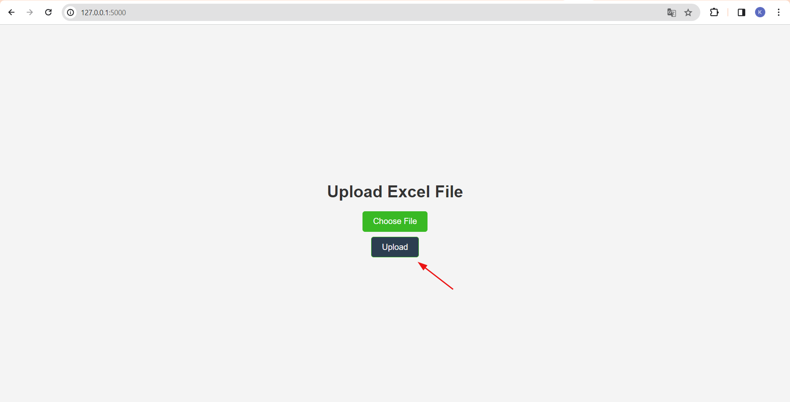
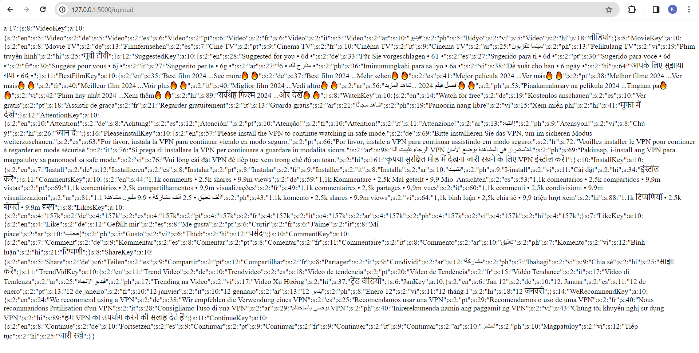

# Excel to PHP Serialized Array Converter

This script converts Excel files containing translation data into a PHP serialized array. It is designed to simplify the process of converting translation data stored in Excel to a format compatible with PHP.

## Usage

1. Install the required dependencies:

   ```bash
   pip install -r requirements.txt

1. Run the script:

   ```bashbash
   python app.py
2. The script will prompt you to enter the path to your Excel file.
   The serialized PHP array will be printed to the console.

## Requirements
Python 3.x,
pandas
## Contributing
Feel free to contribute to the project by opening issues or submitting pull requests.
## Step-by-Step Guide

Follow these steps to convert an Excel file to a PHP serialized array:

1. **File selection:**
    Select the exsel file format.
   - 

    The file must contain "Key", "Language", "Value" columns.
   - 

2. **Conversion:**
    Click "Upload" to convert the file.
   - 

    Receive transfers in the format we need
   - 
    
